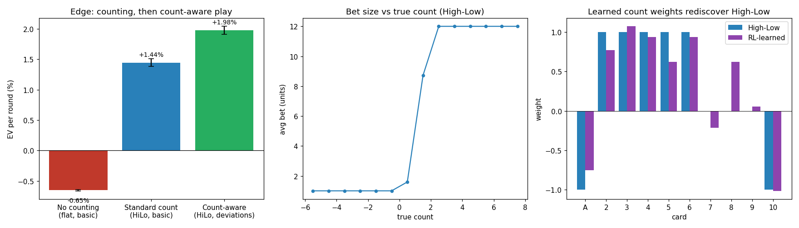

# bjrl — RL blackjack with a deck-history observation

A Python layer over the fast C++ simulator (`../src/sim`). It gives you a
Gymnasium environment, a fast bandit interface for the bet-sizing problem, and a
walkthrough that trains a betting policy with reinforcement learning and compares
it to the classic **High-Low** card-counting system.

The thesis: an agent that observes the *full deck composition* (every card seen)
has strictly more information than any single running count, so it can learn to
bet — and eventually play — at least as well as High-Low, and a bit better.

---

## 1. Build & install

```bash
# from the repo root
python3 -m venv .venv && . .venv/bin/activate
pip install -r python/requirements.txt

# build the pybind11 module into python/bjrl/
cmake -S . -B build/py -DBJ_BUILD_PYTHON=ON \
      -Dpybind11_DIR="$(python -m pybind11 --cmakedir)" \
      -DPython_EXECUTABLE="$(which python)"
cmake --build build/py --target _bjsim -j

cd python && python -c "import bjrl; print('ok', bjrl.OBS_SIZE)"
```

## 2. The Gymnasium environment

```python
import bjrl
env = bjrl.BlackjackEnv(bjrl.RulesConfig())   # 6-deck H17, 3:2, DAS
obs, info = env.reset(seed=0)                  # obs: 35 float32; info["action_mask"]: bool[10]
obs, reward, terminated, truncated, info = env.step(action)
```

- **Episode = one shoe.** `reset()` deals a fresh shuffled shoe; the episode ends
  (`terminated=True`) at the cut card. So the count *evolves within an episode* —
  the whole point of counting.
- **Observation (35 floats):** `[0:10]` used-fraction per rank (the deck history),
  `[10]` penetration, `[11:14]` hand total/soft/pair, `[14:24]` dealer up-card
  one-hot, `[24:34]` legal-action mask, `[34]` phase.
- **Actions (Discrete 10):** `0..4` = bet {1,2,4,8,16} units (bet phase);
  `5..9` = Hit/Stand/Double/Split/Surrender (play phase). `env.action_masks()`
  returns the legal set (used by `MaskablePPO`).

## 3. Card counting & the High-Low baseline

A counter keeps a running count (High-Low: `+1` for 2–6, `−1` for tens & aces,
`0` for 7–9), divides by the decks remaining to get the *true count*, and **bets
more when the true count is high** (the remaining shoe is rich in tens/aces,
which favors the player). Basic strategy is used for every play decision.

`bjrl.evaluate_linear_policy(...)` scores such a policy over millions of rounds in
C++. With a tuned bet ramp at a 1–12 spread, High-Low turns the ~0.6% house edge
into a **player edge** (see results below).

## 4. Train an RL betting policy

`train_es.py` learns its own count. The policy has the same *form* as a counting
system — a weight per rank plus a bet ramp — but the weights are **learned from
reward** (chips won per round) with a cross-entropy evolution strategy, not
hand-designed.

The catch: High-Low is already near the ceiling for a linear betting count, so the
improvement is small and drowns in Monte-Carlo noise. The trainer beats the noise
with a **paired objective** — it scores every candidate against High-Low on the
*same* shoes (common random numbers), so the shared round luck cancels and a
~0.001/round edge becomes measurable.

```bash
python train_es.py     # ~10 min -> artifacts/learned_policy.npz
python compare.py      # paired comparison + plots -> artifacts/comparison.png, summary.txt
```

## 5. Results

Measured over 400M rounds each (6-deck H17, 1–12 spread), regenerate with
`python compare.py` → `artifacts/summary.txt`, `artifacts/comparison.png`:

| player | EV / round | |
|---|---|---|
| **No counting** — flat bet, basic play | **−0.65%** | the house edge |
| **Standard counter** — High-Low bet ramp, basic play | **+1.45%** | counting flips it to a *player* edge |
| **Count-aware** — High-Low bet ramp, play *deviations* + insurance | **+1.98%** | **+37% more EV** |



**The headline: using the deck composition for *play*, not just betting, beats the
standard counter by +0.0053 ± 0.0009 per round (z ≈ 12).** These are the classic
count-based index plays — stand 16 vs 10 when the shoe is ten-rich, take insurance
at a high count, extra doubles — decisions a flat-basic-strategy counter never
makes, and exactly what an agent with the full deck-history observation can learn.

**Betting count (secondary, honest):** `train_es.py` trains an evolution strategy
to learn its *own* count weights from reward. It rediscovers a High-Low-like count
(see the weights panel) but lands **just behind** High-Low (paired diff
−0.0024/round) — High-Low sits within ~0.0007/round of the ceiling for any *linear*
betting count (verified: even Wong Halves beats it by only that much), a margin too
small for the ES's finite search to resolve. The lesson: betting is *not* where the
deck-history observation pays off — **play** is.

## 6. Learn the play deviations from reward (the RL play learner)

Section 5 used the *hand-designed* Illustrious-18 deviations. Can an agent **learn**
them from reward instead of being handed them? Yes.

**Tabular Monte-Carlo control** (`train_mc_play.py`) — blackjack is the classic
MC-control example (Sutton & Barto ch. 5); we extend the state with the true count
so the agent can learn *count-dependent* play. State = (total, soft, pair, dealer
up, true-count bin); reward = chips per round (flat bet, so the play signal is
clean). Starting from basic strategy, it learns deviations on top.

```bash
python train_mc_play.py     # ~4 min -> artifacts/mc_policy.npz
```

It rediscovers the index plays. The clearest: **it learns to stand 16 v 10 exactly
at true count 0** — the textbook Illustrious-18 index — from nothing but wins and
losses:

```
  hand      -4  -3  -2  -1 | 0   1   2   3   4   5    (true count)
  16 v 10   hit hit hit hit|stand stand stand ...     <- flips to STAND at TC 0
```

Honest EV: the learned play lands at **basic-strategy level** (~+1.3–1.5%/round with
count betting), not above it. Each play deviation is worth very little and sits near
the Monte-Carlo noise floor, so reliably extracting *net* gain is hard — the
hand-designed Illustrious-18 (+1.98%) marks the ceiling. What's demonstrated is the
*learning* of the deviation structure, not a new EV record.

Note: this tabular learner keys its state on the High-Low true-count *bin*, so by
construction it can only reach a High-Low-indexed table — it can't exploit the full
composition. For that you need a function approximator over the raw observation ↓.

## 7. End-to-end deep RL — the agent learns its *own* whole strategy

`train_dqn.py` is a from-scratch agent with **no High-Low and no hand-coded rules
anywhere**. It plays on `full_env.py` — a Gymnasium env that adds the **insurance**
decision — and learns *everything* (bet size, insurance, every play) from the raw
39-float observation, whose only deck information is the **10-rank remaining
composition**. It must discover for itself that a ten-rich deck means bet big /
insure / deviate.

Built properly this time: **masked** action selection *and* targets, **Double DQN**
(no Q-overestimation blow-up), a **dueling** network (the actions here have very
close values), reward scaling, a target network, a long ε schedule, and
**checkpoint/resume** for long runs.

```bash
python train_dqn.py --steps 20000000 --logdir runs/dqn1
tensorboard --logdir runs      # watch eval/ev_per_round and the bet-vs-count curve
python train_dqn.py --steps 40000000 --logdir runs/dqn1 --resume runs/dqn1/ckpt.pt
```

TensorBoard logs the loss, ε, mean-Q, a periodic **greedy-policy EV/round** (the
metric that matters), and the **average bet placed at each true count** — so you can
watch a betting strategy emerge from raw composition. The env is validated first
(`python -c "import bjrl.full_env as F; print(F.validate_env())"` reproduces the
known player edge), so any DQN number is measured against a correct env.

This is a genuinely hard learning problem — delayed, high-variance reward, and the
optimal solution is a small discrete table — so it needs long training. It's the one
setup with the *information* to eventually exceed a High-Low counter (§6 explains
why: High-Low is only ~50% efficient for *play*, so the raw composition leaves real
playing EV on the table).

`train_ppo.py` is the same idea via Stable-Baselines3 `MaskablePPO` on the simpler
bet+play `BlackjackEnv` (no insurance), if you'd rather use an off-the-shelf trainer.

## Files

| file | what |
|---|---|
| `bjrl/env.py` | Gymnasium environment over `SimEngine` (bet + play) |
| `bjrl/full_env.py` | end-to-end env with insurance; `validate_env()` self-check |
| `bjrl/baselines.py` | linear-policy evaluation + High-Low ramp tuning |
| `train_es.py` | evolution-strategy trainer (learns a betting count) |
| `compare.py` | paired High-Low vs learned comparison + plots |
| `train_mc_play.py` | Monte-Carlo control: learns count-dependent play deviations |
| `train_dqn.py` | end-to-end Double+Dueling DQN (bet+insurance+play), TensorBoard |
| `train_ppo.py` | MaskablePPO deep-RL example on the bet+play env |
